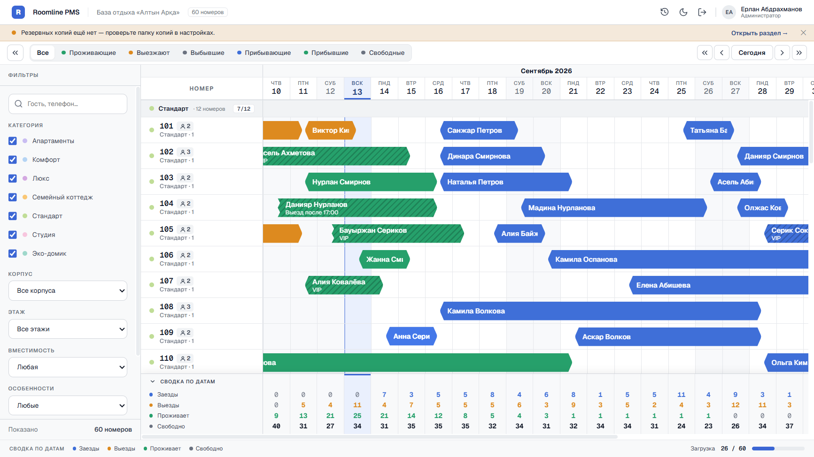
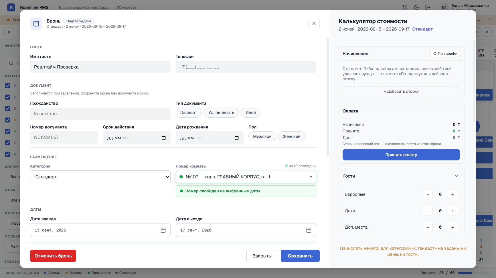
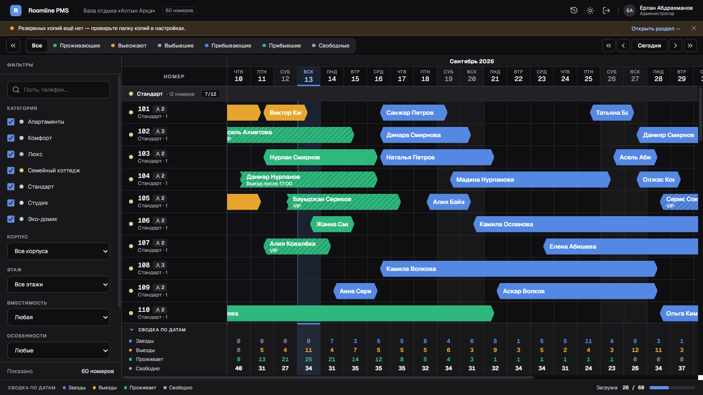
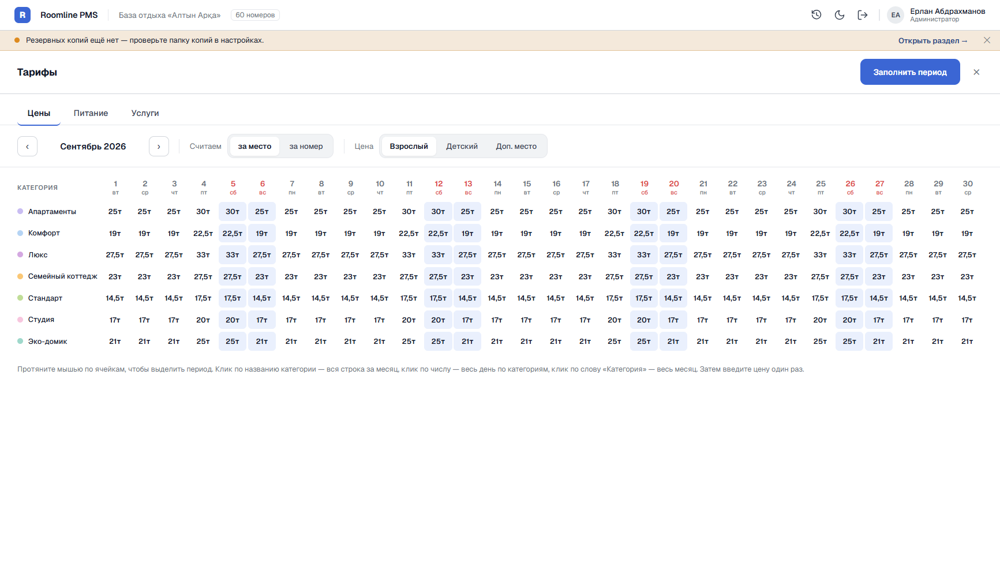
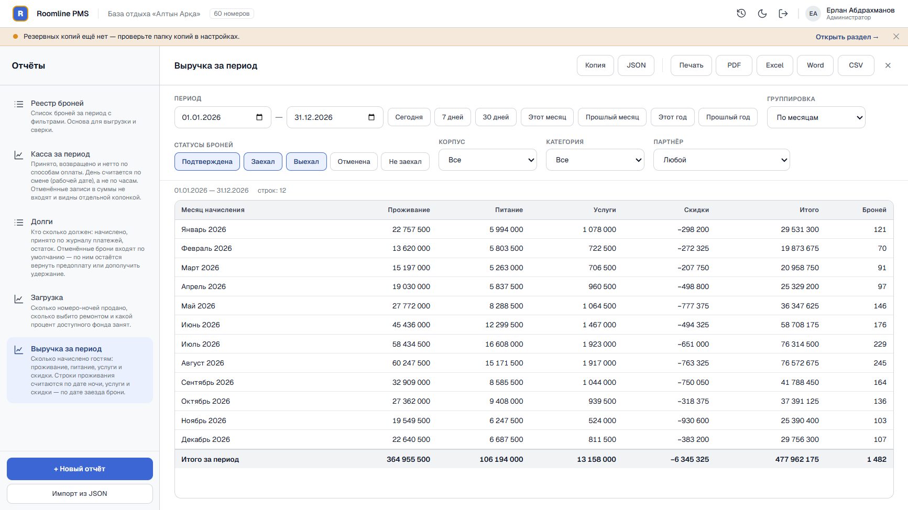
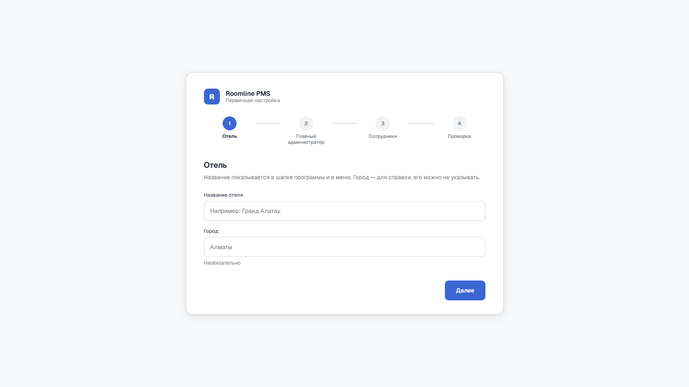
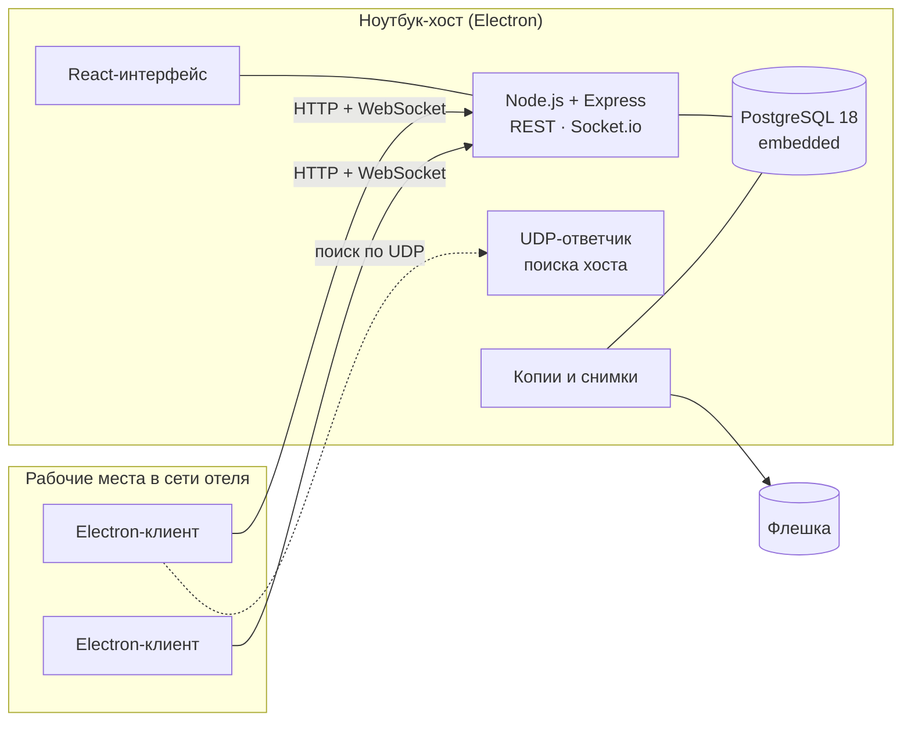

<div align="center">

# Roomline PMS

**Система бронирования для небольших отелей и баз отдыха.**
Программа для Windows, работает в локальной сети отеля без интернета и без облака.




</div>

> **In English.** Roomline PMS is a desktop property-management system for small hotels and
> resorts in Kazakhstan. One laptop acts as the host: it runs an embedded PostgreSQL, the API
> and the UI, and other front-desk PCs join over the local network with automatic host
> discovery. Features include a virtualized booking grid with real-time sync, rates and meal
> plans, payments and cash shifts, a formula-based report engine with Excel/Word/PDF export,
> automatic backups to a USB drive, and offline Ed25519 license keys. The whole stack runs
> from a single Windows installer with no internet connection required.

---

## Зачем это

Маленькие отели и базы отдыха в Казахстане часто ведут брони в тетради или в Excel: брони
пересекаются, долги теряются, отчёт за сезон собирается вручную. Облачные PMS для них
дороги и плохо работают там, где связь пропадает — на Алаколе, в Боровом.

Roomline ставится одним установщиком на обычный ноутбук. Он становится **хостом**: внутри
работают своя база PostgreSQL, сервер и интерфейс. Остальные рабочие места в той же сети
сами находят хост и подключаются к нему. Интернет не нужен ни для работы, ни для проверки
лицензии.

## Возможности

**Шахматка**
- Сетка «номера × даты» с группировкой по категориям, виртуализация строк — сотни номеров
  без подтормаживаний
- Создание брони кликом по свободной ячейке, переезд перетаскиванием
- Фильтры по корпусу, этажу, категории, вместимости и особенностям номера; поиск по гостю
  и телефону
- Сводка по датам: заезды, выезды, проживающие, свободные номера
- Изменения с одного рабочего места сразу видны на остальных (Socket.io)
- Светлая и тёмная темы

**Брони и гости**
- Проверка пересечений дважды: в коде сервера и exclusion-constraint'ом в базе
  (`booking_no_overlap`), поэтому двойная бронь невозможна даже при одновременной записи
  с двух компьютеров
- Замок версии: если бронь успели изменить на другом месте, сохранение не затрёт чужую правку
- Карточка гостя с документом, подстановка данных из прошлого визита по телефону
- Метки броней, партнёры и квоты (аллотменты) с предупреждением о превышении

**Деньги**
- Тарифы по дням и категориям (за место или за номер), питание, услуги, скидки
- Калькулятор стоимости: суммы считает сервер, клиент их только показывает
- Журнал платежей, возвраты, долги, кассовые смены
- Печать подтверждения брони и счёта с реквизитами отеля, сохранение в PDF

**Отчёты**
- Движок отчётов со своим языком формул: реестр броней, касса, долги, загрузка, выручка
- Конструктор новых отчётов, импорт и экспорт определений в JSON
- Выгрузка в Excel, Word, CSV и PDF

**Эксплуатация**
- Мастер первого запуска: отель, главный администратор, сотрудники
- Резервные копии ночью, при старте, каждые 4 часа и при выходе, на флешку или локально;
  снимки состояния по событиям
- Журнал действий пользователей
- Офлайн-лицензия: ключ с подписью Ed25519, 14 дней пробного периода без ключа
- Обновление — новым установщиком поверх старого: данные сохраняются, миграции базы
  применяются при запуске

## Скриншоты

| | |
|---|---|
|  |  |
| Форма брони и калькулятор стоимости | Тёмная тема |
|  |  |
| Тарифы: цена выставляется протягиванием по ячейкам | Выручка за период с выгрузкой в Excel/Word/PDF |

<p align="center"><br>Мастер первого запуска</p>

На скриншотах демонстрационная база: вымышленная «База отдыха „Алтын Арқа“», 60 номеров,
все гости сгенерированы скриптом.

## Архитектура



- **Хост** запускает встроенный кластер PostgreSQL, применяет миграции Prisma, поднимает
  сервер и следит за ним и за базой; если процесс падает, перезапускает его.
- **Клиент** каждые 15 секунд проверяет хост. Если ноутбук-хост сменил адрес (другой Wi-Fi,
  перезагрузка роутера), клиент находит его заново по UDP. Хост подписывает ответ своим
  ключом Ed25519, поэтому подменить его другим компьютером в сети нельзя.
- **Даты броней** хранятся как бизнес-даты отеля, а не календарные: сутки отеля не совпадают
  с полуночью, и ночной заезд попадает в правильный день.

### Стек

| Слой | Технологии |
|---|---|
| Desktop | Electron 44, electron-builder (NSIS), `embedded-postgres` |
| Backend | Node.js, Express 4, Prisma 5, PostgreSQL, Socket.io, JWT, helmet, express-validator, node-cron, winston |
| Frontend | React 18, TypeScript, Vite, Zustand, react-hook-form, `@tanstack/react-virtual`, date-fns |
| Тесты | Vitest: ~1470 тестов в 86 файлах, in-memory Prisma для тестов без базы |

## Структура репозитория

```
hotel-booking/
├── server/            # API: 22 контроллера, движок отчётов, лицензии, копии
│   ├── prisma/        # схема (25 моделей) и миграции
│   ├── src/
│   └── test/          # vitest
├── client/            # React-интерфейс
│   └── src/components # BookingGrid, BookingModal, Payments, Reports, Rates, Settings, Setup…
├── electron/          # хост/клиент, встроенный Postgres, установщик
└── docs/decisions/    # принятые решения по областям: деньги, брони, интерфейс, эксплуатация
```

## Запуск для разработки

Нужны Node.js 20+ и PostgreSQL (в режиме разработки база внешняя, встроенная — только
в установленной программе).

```bash
cd hotel-booking
npm run install:all
cp .env.example server/.env            # указать DATABASE_URL и JWT_SECRET
npm run db:migrate:deploy
npm run db:seed                        # справочники и главный администратор
npm run dev                            # сервер :3001 + интерфейс :5173
```

Демонстрационные данные (стирают базу, запускать только на пустой):

```bash
npm run db:demo -- --reset
```

Остальные команды:

| Команда | Что делает |
|---|---|
| `npm run dev:electron` | сервер, интерфейс и окно Electron |
| `npm run build` | установщик Windows (`electron/dist`) |
| `cd server && npm test` | тесты |
| `cd client && npx tsc --noEmit` | проверка типов |
| `cd electron && node test-host.mjs` | проверка связки «встроенный Postgres + миграции + сервер» |

Подробные заметки для разработки — в [`CLAUDE.md`](CLAUDE.md) и
[`hotel-booking/NOTES.md`](hotel-booking/NOTES.md).

## Как велась разработка

Проект написан одним разработчиком в паре с [Claude Code](https://claude.com/claude-code).
Работа шла волнами: план, реализация, тесты, проверка на клоне базы, запись решения в журнал.
Перед выпуском было два полных аудита — безопасность и персональные данные, деньги,
отчёты, эксплуатация, интерфейс. Найденные ошибки сначала воспроизводились тестом, потом
исправлялись. Отчёты аудитов лежат в
[`hotel-booking/docs/audit-2026-09/`](hotel-booking/docs/audit-2026-09/),
принятые решения с обоснованием — в
[`hotel-booking/docs/decisions/`](hotel-booking/docs/decisions/).

## Лицензия

Исходный код открыт для ознакомления. Все права защищены: использование, копирование
и распространение программы без письменного разрешения автора не допускаются.

© 2026 Абзал Оралбеков
